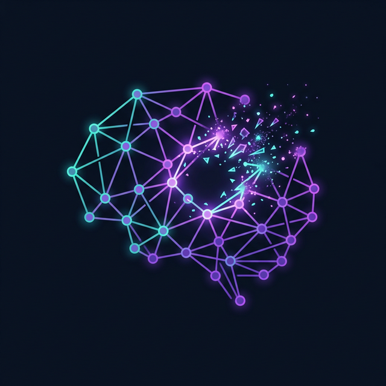

<h1 align="center">
  
  INLP Project: Machine Unlearning with Gemma
</h1>

<p align="center">
  <strong>Iterative Nullspace Projection & Task Arithmetic for Targeted Knowledge Eradication in LLMs.</strong>
</p>

<p align="center">
  <a href="#overview">Overview</a> •
  <a href="#key-methodologies">Methodologies</a> •
  <a href="#repository-structure">Structure</a> •
  <a href="#interactive-website">Website</a> •
  <a href="#running-the-code">Getting Started</a>
</p>

---

## 🚀 Overview

The **INLP (Iterative Nullspace Projection) Project** focuses on the complex challenge of **Machine Unlearning** within Large Language Models (LLMs). As models grow in size and capability, the need to surgically remove specific knowledge—such as copyrighted material (e.g., the *Harry Potter* universe), harmful content, or private data—while preserving the model's general reasoning and linguistic abilities (like MMLU scores) becomes critical.

This repository contains the research, scripts, and an interactive web interface developed to execute and demonstrate targeted unlearning on the **Google Gemma-3-1B-it** architecture.

## 🧠 Key Methodologies

Our approach diverges from traditional fine-tuning, which often leads to catastrophic forgetting, by combining three advanced techniques:

1. **Dataset Optimization (Negative Preference)**
   We utilized the `muse-bench/MUSE` dataset to construct highly specialized `forget` and `retain` corpora. This ensures precise targeting of the domain to be unlearned without bleeding into general knowledge.

2. **Gradient Ascent Unlearning**
   Instead of training the model *on* the data, we train it *away* from the data. By applying Gradient Ascent on the `forget` set, we iteratively push the model's loss higher for the targeted domain, breaking the specific contextual associations within the neural weights.

3. **Task Arithmetic (Weight Subtraction)**
   To finalize the unlearning process, we calculate a **Task Vector** (the difference between the pre-trained weights and the gradient-ascent weights) and subtract this vector from the base model. This surgical operation effectively conceptually "erases" the target knowledge.

4. **4-Bit Quantization**
   To make this research accessible and runnable on standard hardware (like free Kaggle instances), the pipeline heavily leverages **Unsloth** and **BitsAndBytes** for 4-bit NormalFloat (NF4) quantization. This reduces the VRAM footprint from ~16GB to under ~2GB.

## 📂 Repository Structure

```text
├── INLP-Project/
│   ├── Website/                # Interactive WebLLM UI for in-browser unlearned model inference
│   │   ├── index.html
│   │   ├── style.css
│   │   └── script.js
│   ├── scripts/                # Python pipeline for the Unlearning experiments
│   │   ├── 01_load_dataset_model.py
│   │   ├── 02_task_arithmetic_unlearning.py
│   │   ├── 03_gradient_ascent_unlearning.py
│   │   ├── utils.py
│   │   └── read_pdf.py         # Utility script for processing local documentation
│   ├── documentation/          # Initial project plans and methodology outlines
│   │   └── initial_project_plan.pdf
│   └── README.md
```

## 🌐 Interactive Website (WebLLM)

A major component of this project is the **Interactive Web Interface**. Rather than requiring users to clone the repository and run PyTorch scripts, we have deployed a front-end that leverages [WebLLM](https://webllm.mlc.ai/) and WebGPU to run the quantized Gemma model **directly in the browser client's cache**.

### Features:
- **No Backend Required:** The 1.5GB model weights are downloaded directly into the browser cache.
- **Model Selector:** Dynamically switch between the `Base Model`, the `Unlearned Model`, and the `FP16 Variant`.
- **Privacy First:** Since inference runs locally on the user's GPU via WebGPU, data never leaves the browser.

To run the website locally:
```bash
# From the root directory
python3 -m http.server 8080 --directory Website
# Open http://localhost:8080 in your browser
```

## 💻 Running the Code (Kaggle/Colab)

The python unlearning pipeline is designed to be highly modular and is verified to run on platforms like Kaggle.

1. **Install Dependencies:**
   ```bash
   pip install torch transformers datasets accelerate bitsandbytes peft unsloth trl
   ```
2. **Hugging Face Authentication:**
   Our scripts pull the official Gemma weights. You will need to authenticate:
   ```bash
   huggingface-cli login
   ```
3. **Execute Pipeline:**
   Navigate to the `scripts/` directory and run the modules in order. The pipeline will automatically map to CUDA (or fallback to CPU/MPS) and inject LoRA adapters required for unlearning on quantized states.
   ```bash
   python scripts/03_gradient_ascent_unlearning.py
   ```

## 👥 Meet the Team
* **Vijay** - Researcher
* **Anurag** - Researcher
* **Aryanil** - Researcher
* **Harsh** - Researcher
 
*Powered by PyTorch, Hugging Face, and WebLLM.*
